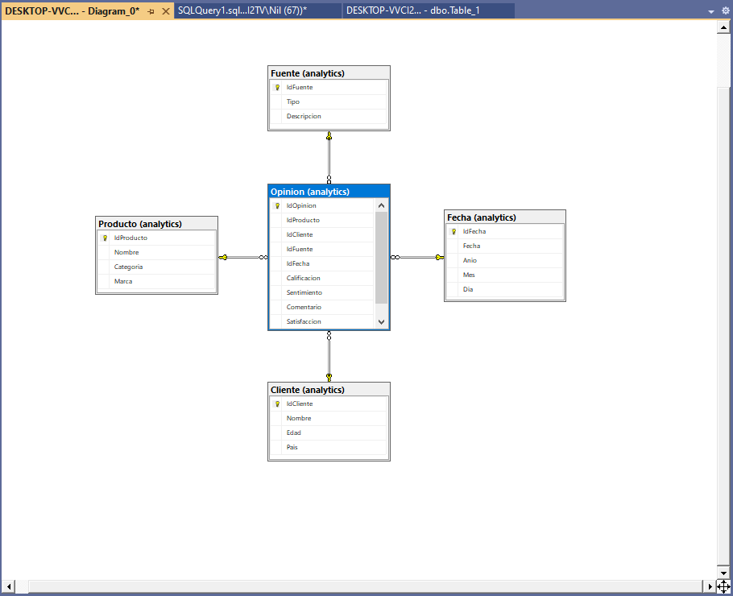
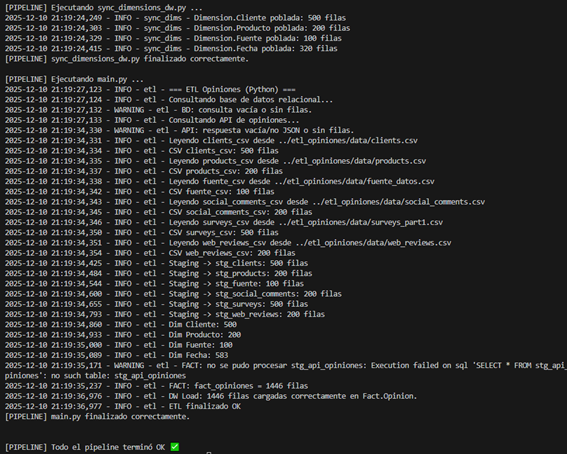
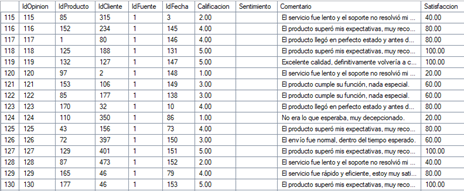

# Sistema ETL para Data Warehouse de Opiniones  
**Proyecto académico — Python + SQLite (Staging) + SQL Server (DW)**  

Este proyecto implementa un pipeline ETL completo para consolidar datos de opiniones provenientes de múltiples fuentes (CSV, base relacional, API simulada) y cargarlos en un **Data Warehouse en SQL Server** con un **esquema en estrella**.

El proceso incluye:  
- Extracción de datos de distintas fuentes.  
- Normalización y limpieza.  
- Carga en tablas de *staging* (SQLite).  
- Construcción de dimensiones limpias y consistentes.  
- Construcción y validación de la tabla de hechos.  
- Carga final al DW respetando llaves foráneas e integridad referencial.  
- Pipeline automatizado.

---

## Arquitectura General del Proyecto


El sistema consta de tres capas:

1. **Staging (SQLite)** —  
   Donde se cargan y estandarizan los datos antes de cualquier validación.

2. **Transformación y Modelado** —  
   Se construyen dimensiones, claves empresariales, columnas calculadas y normalizaciones.

3. **DW en SQL Server** —  
   Modelo en estrella con:
   - **Dimension.Cliente**  
   - **Dimension.Producto**  
   - **Dimension.Fuente**  
   - **Dimension.Fecha**  
   - **Fact.Opinion**

---

## Modelo Dimensional (Esquema en Estrella)
  

### Dimensiones

| Dimensión | Descripción |
|----------|-------------|
| **Cliente** | Datos del cliente del comentario (ID, nombre, email). |
| **Producto** | Catálogo de productos asociados a las opiniones. |
| **Fuente** | Origen del comentario (Web, Encuesta, Social, etc.). |
| **Fecha** | Jerarquía completa de fecha (año, mes, día). |

### Hechos

`Fact.Opinion` contiene cada opinión estandarizada, enlazada a sus dimensiones mediante claves sustitutas.

Columnas principales:  
- IdCliente  
- IdProducto  
- IdFuente  
- IdFecha  
- Calificación  
- Comentario  
- Sentimiento (pendiente de análisis NLP futuro)

---

## Extracción de Datos

Fuentes soportadas:

| Fuente | Tipo | Ejemplo |
|--------|------|---------|
| CSV | Web reviews, encuestas, comentarios sociales | `web_reviews.csv` |
| Base Relacional | Tabla Opiniones en BD operativa | `SELECT * FROM Opiniones` |
| API | Endpoint REST simulado | JSON con opiniones externas |



Los datos pasan por una fase de normalización:

- Estandarización de nombres de columnas  
- Conversión a minúsculas  
- Parsea de fechas  
- Normalización de texto (acentos, espacios, signos)

---

## Staging: Unificación y Normalización

Los datos se cargan en SQLite como:

```
stg_clients
stg_products
stg_fuente
stg_social_comments
stg_surveys
stg_web_reviews
stg_db_opiniones
```

Cada tabla mantiene el esquema exacto que llega desde las fuentes para permitir auditoría.

---

## Construcción de Dimensiones

El archivo `sync_dimensions_dw.py` sincroniza **dimensiones limpias** en el DW:

- Normaliza IDs (C###, P###, F###)  
- Uniformiza categorías y nombres  
- Genera claves sustitutas (IDENTITY en SQL Server)  
- Evita duplicados mediante UPSERT
 
  

---

## Construcción de Hechos

`Fact.Opinion` se construye mediante:

1. Normalización de campos comunes  
2. Mapeo de claves empresariales → sustitutas del DW  
3. Validación estricta de llaves foráneas  
4. Inserción masiva (bulk insert via SQLAlchemy)

Solo se cargan filas cuyo mapeo es válido, evitando errores de integridad.

---

## Automación del Proceso (Pipeline)

Archivo incluido: `pipeline.py`  

Ejecuta:

1. `sync_dimensions_dw.py`  
2. `main.py`  

Comando:

```bash
python pipeline.py
```


---

## Estructura del Proyecto

```
etl_opiniones/
│
├── core/
│   ├── db_engine.py
│   ├── dw_repository.py
│   └── logger.py
│
├── extract/
│   ├── csv_extractor.py
│   ├── db_extractor.py
│   └── api_extractor.py
│
├── transform/
│   ├── clean_data.py
│
├── sync_dimensions_dw.py
├── main.py
├── pipeline.py
├── config/
│   └── settings.json
│
└── data/
    ├── clients.csv
    ├── products.csv
    ├── social_comments.csv
    ├── surveys_part1.csv
    ├── web_reviews.csv
    └── fuente_datos.csv
```

---

## Resultados Finales

- +900 opiniones procesadas  
- 500 clientes normalizados  
- 200 productos limpios  
- DW consistente con integridad referencial  
- Pipeline ejecutable en un solo comando  
- Base perfecta para análisis BI o dashboards

---

## Licencia

Nilfred Baez
